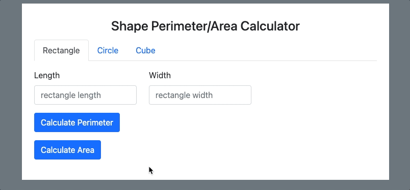

# Shape Perimeter/Area calculator

> Simple PHP script that calculates the perimeter/area/surface area/volume of 2D/3D shapes.

## Set-up
1. Clone/download repo/folder into your PHP server index (e.g. www/htdocs folder)
2. Run program from the index.php